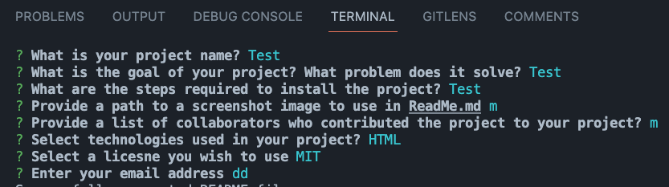

# ReadMe Generator

To quicker generate Readme documents for homework assignments

## Technologies
Node.js

## Installation
1) npm i inquirer

## Mock-up Image 

## Credits 

Yulia Lavine 

## License 
 
 

## Contact 

I can be reached at yulia.lavine@gmail.com